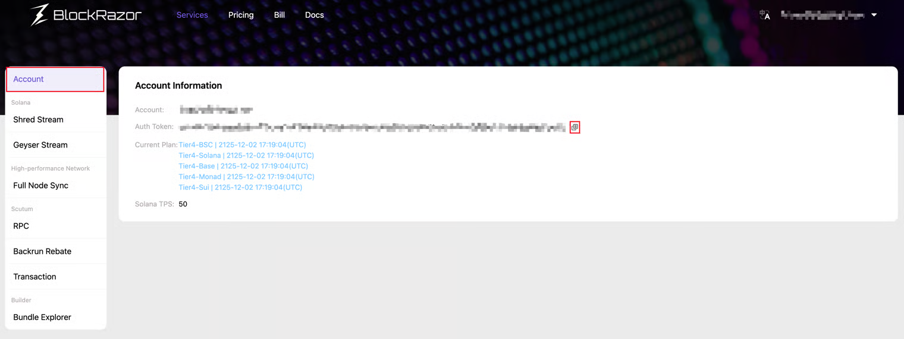

# Authentication

When integrating with BlockRazor services, if "auth" is required in the request, please follow the steps below to obtain it:

1. Go to [https://www.blockrazor.io](https://www.blockrazor.io/) and click on \[Register] in the upper right corner of the webpage, the system will redirect you to the registration page.
2. On the registration page, enter your email and password, then click \[Register], the system will send an account activation email to your mailbox.
3. Go to your mailbox, check the account activation email, and click on the account activation link.
4. After completing the account activation, proceed to log in, check your account information, and copy the auth token.

<figure><figcaption></figcaption></figure>
