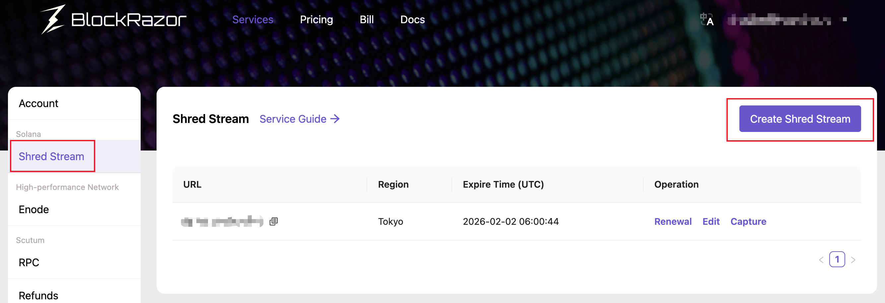
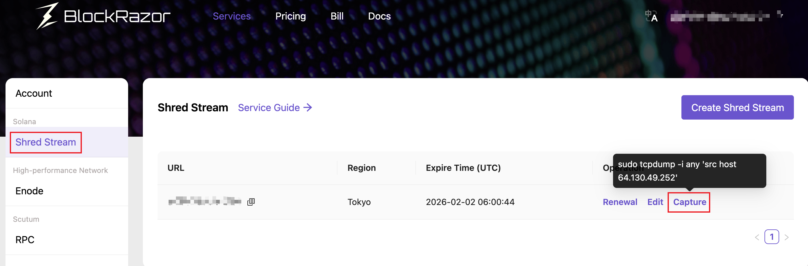

# Shred Stream

## Introduction

Shred Stream delivers shreds at lowest latency to Validators, RPCs, Bots and DeFi Builders.

Based on a global distributed high-performance network, Shred Stream delivers shreds in native UDP packets directly from high-stake validators to clients, minimizing the number of forwarding hops. It is now deployed in Frankfurt, Amsterdam, Tokyo, and New York.


## Price


Users subscribing to a Tier 2 - Solana or higher plan could receive free quota for creating a Shred Stream.


|              | Tier 4 | Tier 3 | Tier 2 | Tier 1 | Tier 0 |
| ------------ | ------ | ------ | ------ | ------ | ------ |
| Shred Stream | -      | -      | 1      | 2      | 5      |


Shred Stream is not tied to a subscription plan and can be purchased independently. The following is the price per steam per region. After purchasing, you can still change the region and the IP:Port where you receive shreds during the validity period.


| Service cycle | Discount | Price             |
| ------------- | -------- | ----------------- |
| 1 month       | 100%     | $500(1 \* $500)   |
| 3 months      | 95%      | $1425(3 \* $475)  |
| 6 months      | 90%      | $2700(6 \* $450)  |
| 9 months      | 85%      | $3825(9 \* $425)  |
| 12 months     | 80%      | $4800(12 \* $400) |


## Instruction

1. Go to [https://www.blockrazor.io/](https://www.blockrazor.io/), click \[Register] in the upper right corner to complete the registration
2. Log in to the console, go to \[Solana] - \[Shred], and click \[Create Shred Stream]

<figure><figcaption></figcaption></figure>

3. Enter the IP:Port or domain:Port of your server, and select the region closest to your server


```bash
# Please ensure that the port is open. If your client is deployed on AWS or other cloud services, you should additionally configure inbound rules for the security group
# The steps to open the port are as follows
sudo ufw allow <port>/udp
sudo ufw reload
```


4. Choose the service cycle and payment method, and confirm the order information
   1. For users subscribed to a Tier 2 - Solana or higher plan, Step 4 is not required to complete the creation.
5. Complete the payment and return to \[Solana] - \[Shred], click \[Capture] to copy the command

<figure><figcaption></figcaption></figure>

6. Access server to run the command to view the shreds delivered from the relay of Shred Stream
