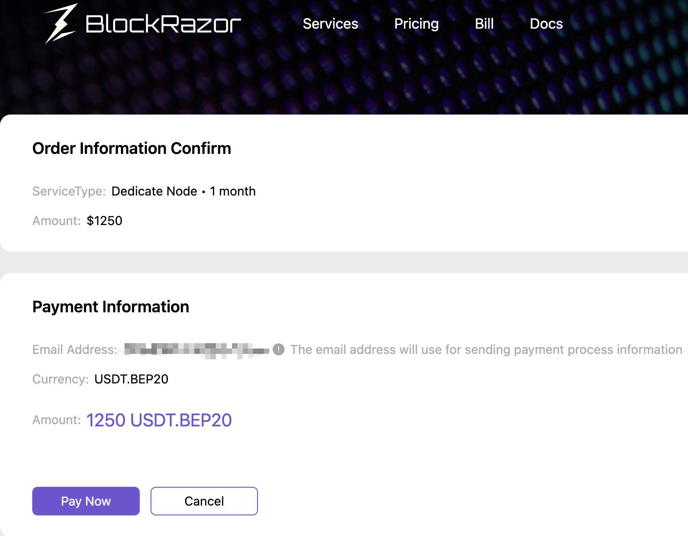

# Create Dedicate Node



### Go to Dedicate Node

<figure><figcaption>
Log in to the Portal
</figcaption></figure>

<figure><figcaption>
Click on 【Dedicate Node】 - 【Create Node】
</figcaption></figure>



### Configure Dedicate Node

<figure><figcaption></figcaption></figure>

* Node Type: Supports BSC full nodes; Solana nodes are coming soon, stay tuned.
* Region: Supports two availability zones: Frankfurt and Virginia. BlockRazor dynamically monitors availability zone resources. If resources are insufficient, Dedicated Nodes cannot be created, please [contact](https://discord.com/invite/qqJuwRb8Nh) us then.
* Server Configuration: Displays the corresponding Dedicated Node server configuration based on the availability zone.
* Node Client: Supports the Geth client.



### Select Service Period and Payment Method

<figure><figcaption></figcaption></figure>

Currently, only cryptocurrency payments are supported. The supported cryptocurrencies are USDT.BEP20, USDT.ERC20, and USDT.PRC20.



### Pay with Cryptocurrency

<figure><figcaption>
Click on Pay Now
</figcaption></figure>

<figure><figcaption>
Click on Wallet or scan the QR code to complete the payment
</figcaption></figure>

Note: After completing the payment, please wait patiently. The system will take a few minutes to confirm your payment. You can check the progress in the bill.



### Wait for node to be created

<figure><figcaption></figcaption></figure>



### Utilize Dedicate Node

See [Utilize Dedicate Node](utilize-dedicate-node.md) for details



