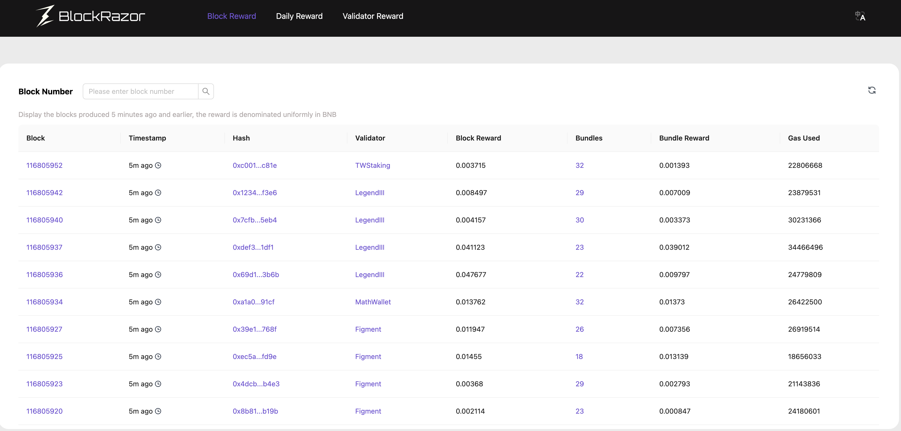
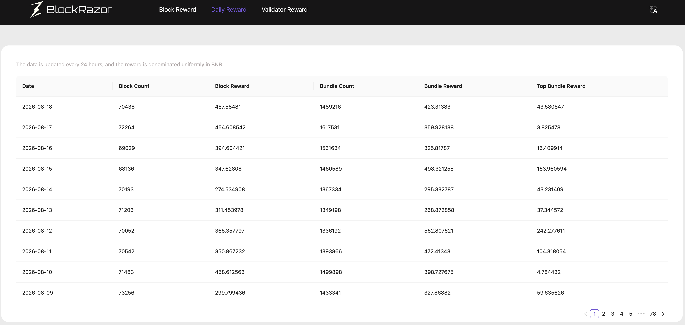
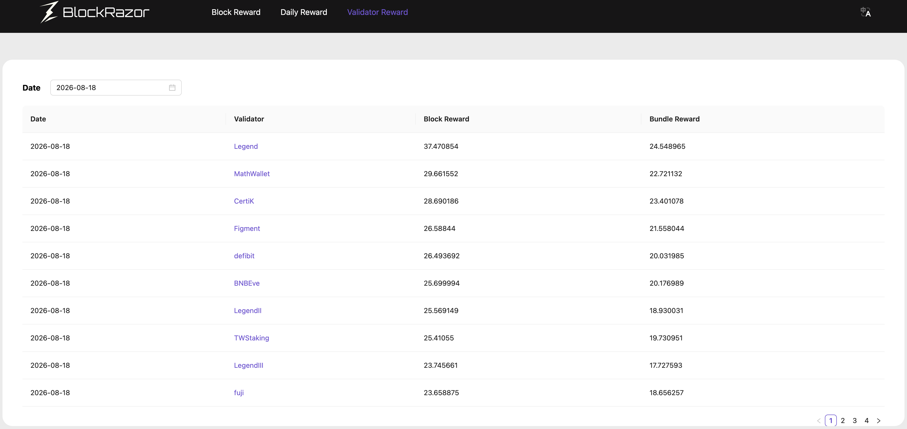

---
metaLinks:
  canonical: bundle-explorer.md
---

# BSC Block Builder Bundle Explorer


Bundle Explorer is packaged with the Bundle Tracing service. Users who purchase Bundle Tracing can access Bundle Explorer after signing in to the BlockRazor Portal.


## BSC Bundle Explorer

### Product Definition

BSC Bundle Explorer is a block and bundle data exploration tool built by BlockRazor for the BSC Block Builder ecosystem.

It presents block rewards and bundle rewards from three perspectives: blocks, dates, and validators. Users can also inspect the bundles and transaction composition within a block. This helps searchers, builders, validators, and researchers understand on-chain bundle execution and reward performance.

### Core Capabilities

#### Block Reward

View BSC blocks, validators, block rewards, bundle counts, and bundle rewards. Users can search by block number and expand an individual block to inspect its bundles and transaction details, including addresses, gas used, gas price, and transaction fees.

<figure><figcaption></figcaption></figure> <figure><figcaption></figcaption></figure>

#### Daily Reward

Review daily totals for blocks, bundles, block rewards, bundle rewards, and the highest bundle reward. This provides a clear view of BSC bundle activity and reward trends over time.

<figure><figcaption></figcaption></figure>

#### Validator Reward

View block rewards and bundle rewards for different validators on a selected date. This makes it easier to compare validator reward performance and composition.

<figure><figcaption></figcaption></figure>

### Use Cases

* **Searcher strategy review**: Confirm whether a bundle was included in a block and inspect its transaction composition, including 0 Gwei transactions.
* **Builder and validator analysis**: Compare block rewards and bundle rewards to understand validator performance.
* **On-chain research**: Track daily bundle volume and reward changes to observe activity across the BSC bundle market.
* **Issue investigation**: Start from a block number and drill down into bundles and transactions to verify on-chain execution results.

### Product Value

BSC Bundle Explorer brings block, bundle, transaction, and validator data into one interface, reducing the cost of manual on-chain research and data collection. Users can review strategies, analyze rewards, and investigate execution issues more efficiently while gaining a unified view of bundle activity across the BSC Block Builder ecosystem.

### Data Notes

* All reward values are displayed in BNB.
* Block Reward displays blocks produced at least five minutes ago.
* Daily Reward data is updated every 24 hours.
