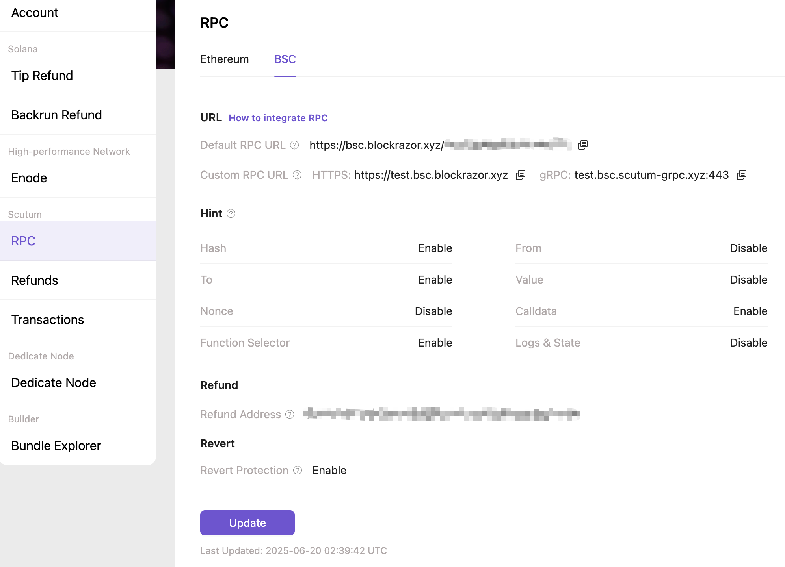

# gRPC

### Introduction

BlockRazor RPC now supports sending requests(including standardized JSON RPC,  `sendMevBundle` and `Query TxProcessStatus`) based on the gRPC protocol, which can reduce communication latency and computing overhead compared to the HTTPS protocol, further improving transaction inclusion rate and auction winning rate. It is currently available on BSC.


### Price

<table><thead><tr><th width="149.75">Tier 4</th><th>Tier 3</th><th>Tier 2</th><th>Tier 1</th><th>Tier 0</th></tr></thead><tbody><tr><td>-</td><td>-</td><td>-</td><td>✅</td><td>✅</td></tr></tbody></table>


### Endpoint

The steps to obtain the gRPC endpoint domain are as follows:

1. [Register](https://www.blockrazor.io/#/register) BlockRazor
2. [Log in](https://www.blockrazor.io/#/login) to the console, go to the \[RPC] module, select BSC, and click \[Update]

<figure><figcaption></figcaption></figure>

3. Enter the custom third-level domain in the HTTPS URL, and the domain of gRPC will be updated correspondingly
4. Click \[Update] to update the custom URL, copy the gRPC URL


### Request Example

```go
package main

import (
	"context"
	"crypto/tls"
	"encoding/json"
	"fmt"
	pb "github.com/easydo666/geth-grpc/rpc"
	"github.com/ethereum/go-ethereum/common"
	"github.com/ethereum/go-ethereum/common/hexutil"
	"github.com/ethereum/go-ethereum/core/types"
	"github.com/ethereum/go-ethereum/crypto"
	"google.golang.org/grpc"
	"google.golang.org/grpc/credentials"
	"log"
	"math/big"
)

var From string = "0xSomePublicAddress12439439c739036a7660ec1"
var PrivateKey string = "your from address's privateKey"
var To string = "0xSomePublicAddress12439439c739036a7660ec2"
var gRPCEndpoint string = "gRPC url" // get gRPC URL from portal

func main() {
	// 1. create a new gRPC client connection
	conn, err := grpc.NewClient(gRPCEndpoint, grpc.WithTransportCredentials(credentials.NewTLS(&tls.Config{})))
	if err != nil {
		log.Fatalf("failed to connect: %v", err)
	}
	defer conn.Close()
	client := pb.NewJsonRpcServiceClient(conn)

	// 2. construct the JSON-RPC request and obtain the nonce
	var params []string = []string{From, "pending"}
	b, _ := json.Marshal(params)

	req := &pb.JsonRpcRequest{
		Jsonrpc: "2.0",
		Method:  "eth_getTransactionCount",
		Params:  string(b),
		Id:      "1",
	}

	jsonRpc, err := client.CallJsonRpc(context.Background(), req)
	if err != nil || jsonRpc.GetError() != "" {
		if err != nil {
			fmt.Println(err)
		} else {
			fmt.Println(jsonRpc.GetError())
		}
	}
	var nonce hexutil.Uint64
	err = json.Unmarshal([]byte(jsonRpc.GetResult()), &nonce)

	// 3. construct the JSON-RPC request and send the transaction
	to := common.HexToAddress(To)
	tx := types.NewTx(&types.LegacyTx{Nonce: uint64(nonce), GasPrice: big.NewInt(1e8), Gas: 21000, To: &to, Value: big.NewInt(0)})

	privateKey, err := crypto.HexToECDSA(PrivateKey)
	if err != nil {
		log.Fatal(err)
	}
	signedTx, err := types.SignTx(tx, types.NewEIP155Signer(big.NewInt(56)), privateKey)
	if err != nil {
		log.Fatal(err)
	}
	binary, _ := signedTx.MarshalBinary()
	encode := hexutil.Encode(binary)

	b, _ = json.Marshal([]string{encode})
	req = &pb.JsonRpcRequest{
		Jsonrpc: "2.0",
		Method:  "eth_sendRawTransaction",
		Params:  string(b),
		Id:      "1",
	}

	res, err := client.CallJsonRpc(context.Background(), req)
	if err != nil || res.GetError() != "" {
		if err != nil {
			fmt.Println(err)
		} else {
			fmt.Println(res.GetError())
		}
	}
	fmt.Println(res.GetResult())
}
```


