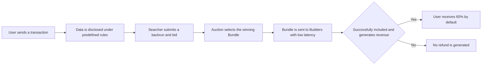

# BSC RPC Refund Mechanism

## BSC RPC Refund Mechanism

When a transaction is sent through BlockRazor BSC RPC, it can enter the orderflow auction under predefined disclosure rules without being exposed to the public mempool. Searchers use the permitted information to independently identify backrun opportunities and submit bids. If the winning backrun Bundle is successfully included on-chain and generates revenue, the user receives **60% of the distributable revenue by default**.

#### How Are Refunds Generated?

**1. The User Sends a Transaction Normally**

Users can send transactions through `eth_sendRawTransaction` in the same way they would with a standard BSC RPC. BlockRazor BSC RPC is compatible with standard JSON-RPC methods, so users do not need to modify the transaction itself.

After entering BlockRazor’s private path, the complete transaction is not directly broadcast to the public mempool. This reduces exposure to malicious MEV attacks such as sandwich attacks and frontrunning.

**2. Transaction Information Is Disclosed Under Predefined Rules**

The scope of transaction data disclosure is determined during integration. Configurable fields include the transaction hash, sender, recipient, `value`, `nonce`, `calldata`, `function selector`, and `logs`.

Only explicitly enabled fields are disclosed. Fields that are not enabled remain private.

**3. Searchers Independently Identify Backrun Opportunities**

Eligible Searchers can subscribe to the permitted transaction information through the BSC Private Mempool. Searchers independently analyze this information and determine whether they can construct a backrun strategy that does not harm the user’s transaction outcome.

If a Searcher identifies an executable opportunity, it constructs a backrun Bundle and submits a bid with the Bundle. If no Searcher submits a valid backrun Bundle, or if the Bundle does not generate revenue, the user will not receive a refund.

**4. The Winning Bundle Is Selected Through the Orderflow Auction**

BlockRazor RPC conducts an English auction based on the bid amount. Searchers can continuously submit different backrun Bundles to participate in the auction. BlockRazor sends the winning Bundle to mainstream Builders with low latency.

The refund recipient address, refund configuration, and bid amount are validated. Revenue collection and distribution are handled through smart contracts.

**5. Revenue Is Refunded to the User After Successful Inclusion**

Revenue is distributed only when the user’s transaction and the winning backrun Bundle are successfully included on-chain and the backrun generates actual revenue.

By default, the user receives **60% of the distributable backrun revenue**. The remaining portion covers service fees and the Builder’s transaction execution costs.

#### What Does the User Need to Do?

Individual users only need to switch the BSC RPC in their wallet to BlockRazor BSC RPC and send transactions as usual. Users do not need to manually manage Searcher participation or determine whether a transaction generates a refund.

Wallets, DEXs, and other projects using a dedicated RPC can define transaction disclosure rules, refund recipient addresses, and other settings during integration. After configuration, BlockRazor processes subsequent transactions according to the predefined rules.

#### Does Every Transaction Receive a Refund?

No. A refund requires all of the following conditions to be met:

* The transaction enters the orderflow auction under the predefined disclosure rules
* A Searcher identifies an executable backrun opportunity using the disclosed information
* The Searcher submits a valid backrun Bundle and participates in the auction
* The winning Bundle and the user’s transaction are successfully included on-chain
* The backrun generates distributable revenue

A refund is therefore not a fixed reward and is not guaranteed for every transaction. Even when no refund is generated, the user’s transaction continues through the BlockRazor BSC RPC submission path and receives the applicable transaction privacy and malicious MEV protection.

#### When Will the Refund Arrive?

After the winning Bundle is successfully included on-chain and generates revenue, the refund is distributed through an on-chain smart contract. It can usually be processed in the same block as the user’s transaction. The actual arrival time depends on the on-chain inclusion of the transaction and Bundle.
