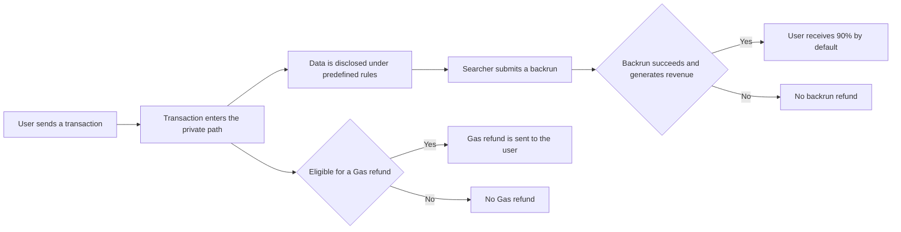

# Ethereum RPC Refund Mechanism

When a transaction is sent through BlockRazor Ethereum RPC, it can enter the private orderflow under predefined disclosure rules without being exposed to the public mempool. Searchers use the permitted information to independently identify backrun opportunities. If a backrun is successfully included on-chain and generates revenue, the user receives **90% of the distributable backrun revenue by default**.

In addition to backrun refunds, transactions that meet the predefined Gas refund rules may also receive a **Gas refund**. These are two independent sources of refunds. A transaction may receive either one, both, or neither.

### How Are Refunds Generated

**1. The User Sends a Transaction Normally**

Users can send transactions through `eth_sendRawTransaction` in the same way they would with a standard Ethereum RPC. BlockRazor Ethereum RPC is compatible with standard JSON-RPC methods, so users do not need to modify the transaction itself.

**2. Transaction Information Is Disclosed Under Predefined Rules**

The scope of transaction data disclosure is determined during integration. Configurable fields include the transaction hash, sender, recipient, `value`, `nonce`, and `calldata`. Only explicitly enabled fields are disclosed. Fields that are not enabled remain private.

**3. Searchers Independently Identify Backrun Opportunities**

Eligible Searchers can subscribe to the permitted transaction information and independently analyze whether they can construct a backrun strategy that does not harm the user’s transaction outcome.

**4. Backrun Revenue Is Refunded to the User**

Revenue is distributed only when the user’s transaction and the backrun are successfully included on-chain and the backrun generates actual revenue. By default, the user receives **90% of the distributable backrun revenue**.

**5. Eligible Transactions Receive a Gas Refund**

Gas refunds and backrun refunds are two separate refund mechanisms. Transactions that meet the predefined Gas refund rules may receive a refund for their qualifying Gas costs, reducing the user’s effective transaction cost.

A Gas refund does not depend on whether the transaction has a backrun opportunity. Even if a transaction generates no backrun revenue, it may still receive a Gas refund as long as it meets the Gas refund rules.

### What Does the User Need to Do

Individual users only need to switch the Ethereum RPC in their wallet to BlockRazor Ethereum RPC and send transactions as usual. Users do not need to manually manage Searcher participation or determine whether their transactions qualify for Gas refunds.

Wallets, DEXs, and other projects using a dedicated RPC can define transaction disclosure rules, refund recipient addresses, and other refund settings during integration. After configuration, BlockRazor processes subsequent transactions according to the predefined rules.

### Does Every Transaction Receive a Refund

No. The two refund types have different requirements.

**A Backrun Refund Requires**

* The transaction enters the private orderflow under the predefined disclosure rules
* A Searcher identifies an executable backrun opportunity using the disclosed information
* The Searcher submits a valid backrun
* The user’s transaction and the backrun are successfully included on-chain
* The backrun generates distributable revenue

**A Gas Refund Requires**

* The user’s transaction is included on-chain and incurs qualifying Gas expenditure

Refunds are therefore not fixed rewards and are not guaranteed for every transaction. Even when no refund is generated, the transaction continues through the BlockRazor Ethereum RPC submission path and receives the applicable transaction privacy and malicious MEV protection.

### When Will the Refund Arrive

After a backrun is successfully included on-chain and generates revenue, the backrun refund is distributed in real time according to the predefined rules.

Gas refunds are processed according to the transaction execution result and the current Gas refund policy.

